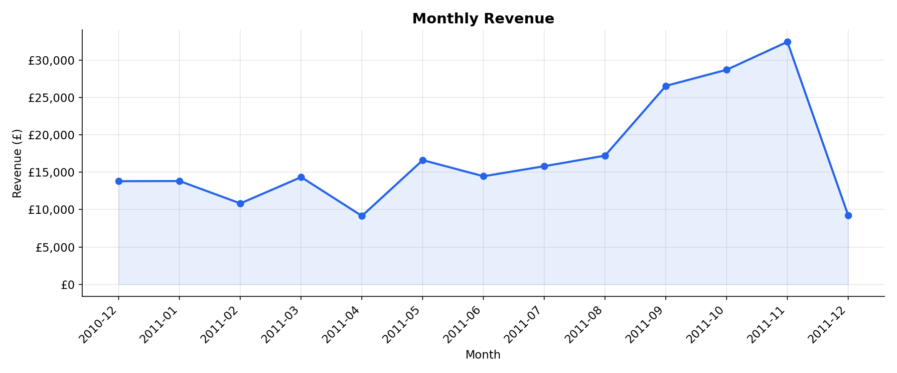
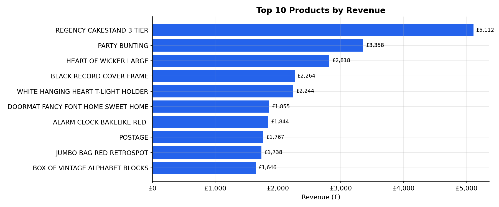
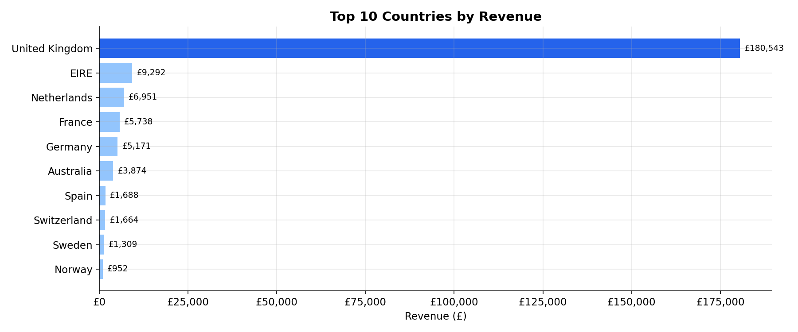
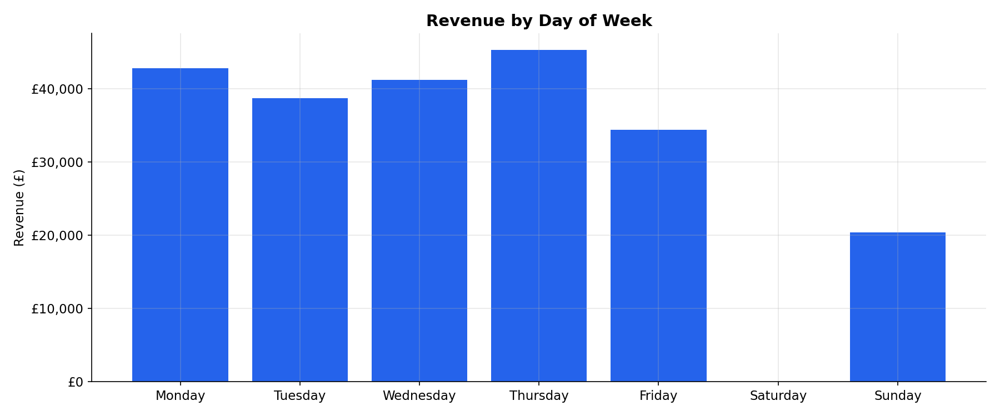
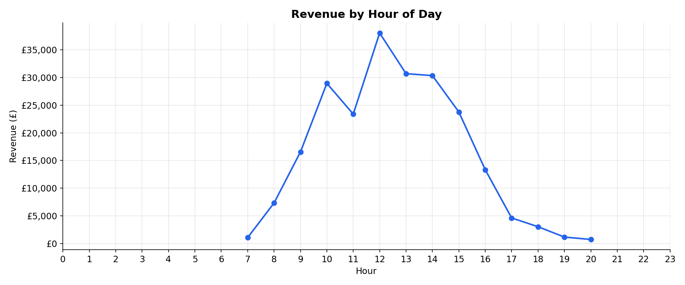
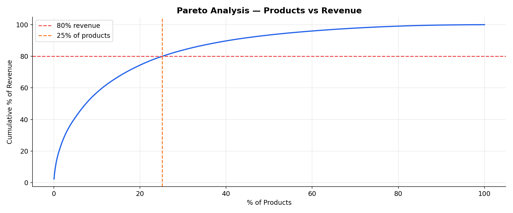
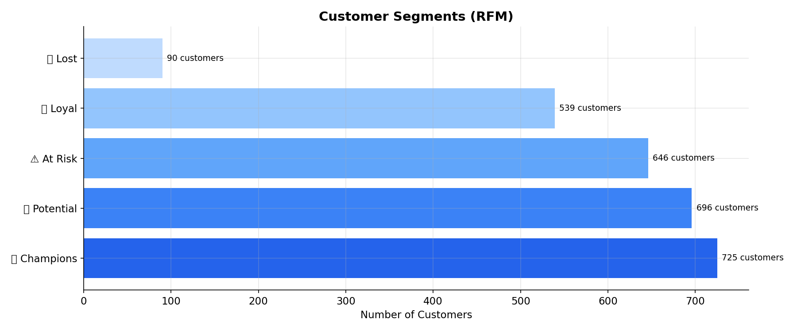
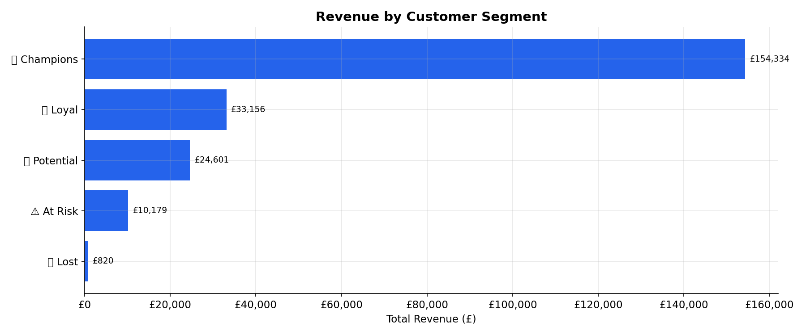

# 📊 Business Analytics Portfolio

**Data Analyst | Business Intelligence | Financial Reporting**  
📍 Bulgaria &nbsp;|&nbsp; 📧 [kuzevastasy@gmail.com](kuzevastasy@gmail.com) &nbsp;|&nbsp; 🔗 [LinkedIn](https://www.linkedin.com/in/stanislava-kuzeva-b1757241/)

---

## 👋 About This Portfolio

This repository contains end-to-end business analytics case studies built with Python.  
Each project covers the full analytics cycle: data cleaning → exploration → insight generation → business recommendations.

**Core skills demonstrated:** data wrangling, KPI tracking, customer segmentation, revenue analysis, interactive dashboards.

---

## 📁 Projects

### 🛒 E-Commerce Sales Analysis
> *Uncovering revenue drivers, customer behavior, and seasonal patterns from 500k+ real transactions*

**Dataset:** UK-based online retailer (Kaggle, 2010–2011) — ~500,000 transactions  
**Tech stack:** Python · pandas · matplotlib · Streamlit · Jupyter Notebook

#### Business Questions Answered
- When does the business generate the most revenue?
- Which products drive the majority of sales (Pareto principle)?
- Who are the most valuable customers?
- How does performance vary by country?
- Are there signs of seasonality?

#### Key Findings
| Finding | Detail |
|---|---|
| 📈 Strong Q4 seasonality | Revenue peaks significantly in October–December |
| 🛍 Pareto effect | ~20% of products generate ~80% of total sales |
| 🇬🇧 UK dominance | The UK contributes the largest share of revenue |
| 💎 High-value customers | Champions segment drives a disproportionate share of revenue |

#### 📊 Visualizations

**Monthly Revenue Trend**  


**Top 10 Products by Revenue**  


**Revenue by Country**  


**Revenue by Day of Week**  


**Revenue by Hour**  


**Pareto Analysis — 80/20 Rule**  


**Customer Segments (RFM)**  


**Revenue by Customer Segment**  


#### Business Recommendations
- Focus marketing campaigns on **Champions** and **Loyal** customer segments
- Increase stock levels for top-performing products before Q4
- Launch re-engagement campaign for **At Risk** customers
- Explore growth opportunities in Netherlands and Germany

#### 📊 Live Dashboard
🚀 **[Open Dashboard →](https://business-analytics-portfolio.streamlit.app)**

Run locally:
```bash
pip install -r requirements.txt
streamlit run app/dashboard.py
```

---

## 🗂 Repository Structure

```
Business-Analytics-Portfolio/
│
├── data/
│   ├── raw/                    # Original dataset
│   └── processed/              # Cleaned data (generated by notebook 02)
├── notebooks/
│   ├── 01-data-overview.ipynb
│   ├── 02-data-cleaning.ipynb
│   ├── 03-eda.ipynb
│   └── 04-business-insights.ipynb
├── app/
│   └── dashboard.py            # Streamlit dashboard
├── reports/
│   └── figures/                # Exported charts
├── requirements.txt
└── README.md
```

---

## 🛠 Tech Stack

| Tool | Usage |
|---|---|
| Python | Core language |
| pandas | Data cleaning and transformation |
| matplotlib | Static visualizations |
| Streamlit | Interactive dashboard |
| Jupyter Notebook | Exploratory analysis |

---

## 🚀 How to Run

```bash
# 1. Clone the repository
git clone https://github.com/KuzevaStasy/Business-Analytics-Portfolio.git
cd Business-Analytics-Portfolio

# 2. Install dependencies
pip install -r requirements.txt

# 3. Run the notebooks in order
jupyter notebook notebooks/

# 4. Or launch the dashboard
streamlit run app/dashboard.py
```

---

## 📬 Contact

- **LinkedIn:** [https://www.linkedin.com/in/stanislava-kuzeva-b1757241/](https://www.linkedin.com/in/stanislava-kuzeva-b1757241/)
- **Email:** [kuzevastasy@gmail.com](kuzevastasy@gmail.com)
- **GitHub:** [@KuzevaStasy](https://github.com/KuzevaStasy)
